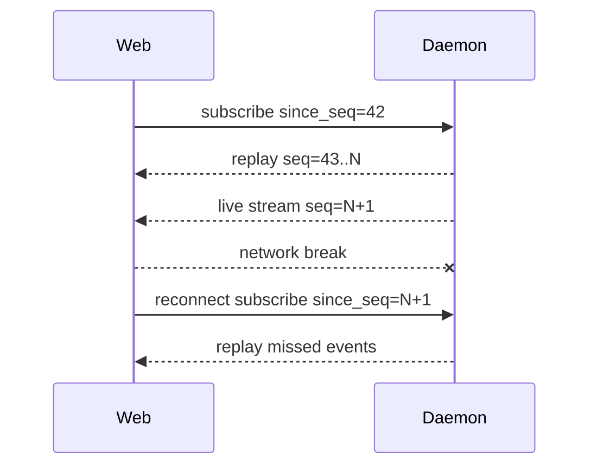
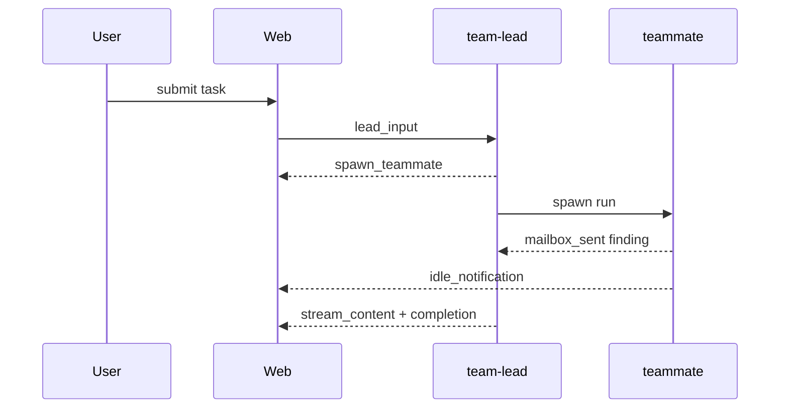
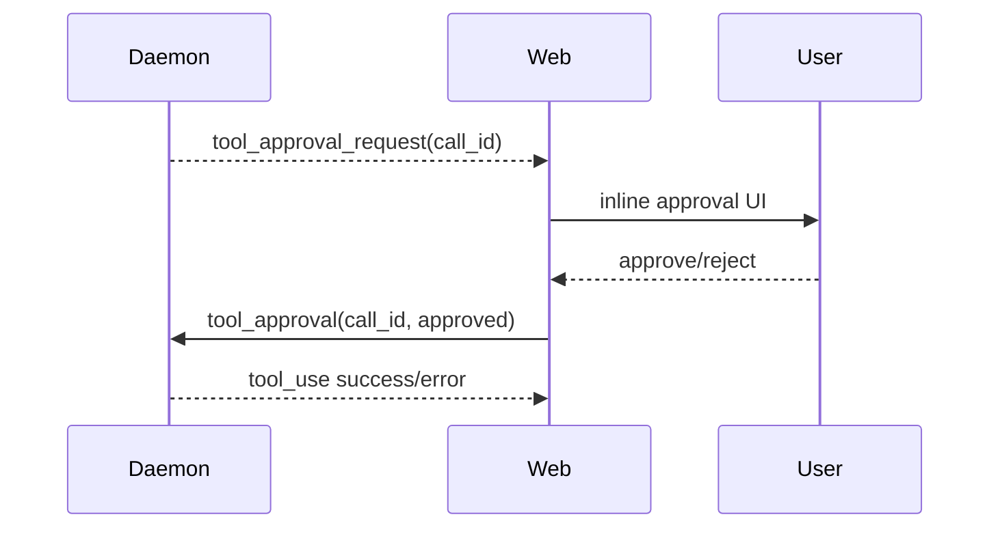

# Nano Agent Daemon API（Web 客户端实现指南）

## 0. 阅读指南

本文面向 Web/桌面客户端实现者，描述 nano daemon 的 REST 与 WebSocket 协议。当前版本为 v4，包含破坏性变更：CLI 纯文本流式渲染已移除，交互式渲染统一由 BubbleTea/tview TUI 消费 EventSource；自动化场景请使用 `nano daemon execute --json`。

## 1. 协议总览

| 项 | 说明 |
|---|---|
| Base URL | `http://HOST:PORT/api/v1` |
| WebSocket | `ws://HOST:PORT/api/v1/stream` 或 `/teams/sessions/{id}/stream` |
| 鉴权 | `X-API-Key` header 或 `?api_key=` query |
| 编码 | UTF-8 JSON |
| 错误 | `{ "error": "message", "code": "optional_code" }` |
| 限流 | 对 HTTP 429/503、网络超时、WebSocket 异常关闭实现指数退避：1s/2s/5s/10s/30s，封顶 30s |

## 2. REST API 路由总表

| Method | Path | 鉴权 | 幂等性 | 用途 |
|---|---|---:|---:|---|
| GET | `/api/v1/health` | 否 | 是 | 健康检查 |
| GET | `/api/v1/status` | 是 | 是 | daemon 状态 |
| GET | `/api/v1/sessions` | 是 | 是 | 列出普通会话 |
| GET | `/api/v1/sessions/{id}` | 是 | 是 | 查看会话 |
| DELETE | `/api/v1/sessions/{id}` | 是 | 是 | 删除会话 |
| POST | `/api/v1/sessions/{id}/execute` | 是 | 否 | 同步/异步执行 |
| POST | `/api/v1/sessions/{id}/cancel` | 是 | 是 | 取消当前任务 |
| POST | `/api/v1/sessions/reset` | 是 | 是 | 重置普通会话 |
| GET | `/api/v1/teams/sessions` | 是 | 是 | 列出 team-lead 会话 |
| POST | `/api/v1/teams/sessions` | 是 | 是 | 创建/恢复 team-lead 会话 |
| GET | `/api/v1/teams/sessions/{id}/events?since_seq=N` | 是 | 是 | HTTP poll 续传 |
| POST | `/api/v1/teams/sessions/{id}/cancel` | 是 | 是 | 取消 team-lead 任务 |

## 3. REST API 详解

### GET /api/v1/health

| 字段 | 类型 | 说明 |
|---|---|---|
| status | string | `ok`/`healthy` |
| timestamp | number | Unix 秒 |
| version | string | daemon 版本 |

```bash
curl http://127.0.0.1:8080/api/v1/health
```

```ts
export interface HealthResponse { status: string; timestamp: number; version: string; uptime?: number }
```

### GET /api/v1/status

```bash
curl -H "X-API-Key: $NANO_API_KEY" http://127.0.0.1:8080/api/v1/status
```

```ts
export interface StatusResponse { agent_status: string; mcp_enabled: boolean; memory_size: number; active_tools: number }
```

### Sessions

```bash
curl -H "X-API-Key: $NANO_API_KEY" http://127.0.0.1:8080/api/v1/sessions
curl -X POST -H "X-API-Key: $NANO_API_KEY" -H 'Content-Type: application/json' \
  -d '{"command":"hello","timeout":120}' \
  http://127.0.0.1:8080/api/v1/sessions/web-1/execute
curl -X POST -H "X-API-Key: $NANO_API_KEY" http://127.0.0.1:8080/api/v1/sessions/web-1/cancel
curl -X POST -H "X-API-Key: $NANO_API_KEY" -H 'Content-Type: application/json' \
  -d '{"session_id":"web-1"}' http://127.0.0.1:8080/api/v1/sessions/reset
```

```ts
export interface ExecuteRequest { command: string; timeout?: number; include_steps?: boolean; async?: boolean }
export interface ExecuteResponse { success: boolean; result: string; error?: string; session_id?: string; run_id?: string; status?: string; completed?: boolean; token_stats?: TokenStats }
export interface SessionSummary { id: string; type?: string; title?: string; created_at?: string; last_active_at?: string; status?: string; stored?: boolean; active?: boolean }
export interface SessionsListResponse { success: boolean; sessions: SessionSummary[] }
```

### Team-lead sessions

```bash
curl -X POST -H "X-API-Key: $NANO_API_KEY" -H 'Content-Type: application/json' \
  -d '{"session_id":"lead-alpha-chat","team_name":"alpha","interactive_confirm":true}' \
  http://127.0.0.1:8080/api/v1/teams/sessions
curl -H "X-API-Key: $NANO_API_KEY" \
  'http://127.0.0.1:8080/api/v1/teams/sessions/lead-alpha-chat/events?since_seq=42'
```

```ts
export interface TeamLeadSessionRequest { session_id?: string; team_name: string; interactive_confirm?: boolean }
export interface TeamLeadSessionResponse { session_id: string; team_name: string; status: string; created_at?: string; last_active_at?: string }
```

## 4. WebSocket 协议

### 4.1 连接建立

普通会话连接 `/api/v1/stream`，发送 `subscribe` 帧指定 `session_id`。Team-lead 会话连接 `/api/v1/teams/sessions/{id}/stream`，可直接发送 `lead_input` 或 `subscribe`。

### 4.2 帧分类总览

Client → Server：`subscribe`、`command`、`lead_input`、`tool_approval`、`cancel`、`ping`。

Server → Client：`session_start`、`stream_content`、`thinking`、`tool_call`、`tool_result`、`tool_use`、`tool_approval_request`、`mailbox_sent`、`idle_notification`、`spawn_teammate`、`error`、`completion`、`pong`、`chunk`。

### 4.3 每帧 JSON Schema

#### subscribe

| 字段 | 类型 | 必填 | 说明 |
|---|---|---:|---|
| type | string | 是 | `subscribe` |
| session_id | string | 普通会话必填 | 会话 ID |
| since_seq | number | 否 | 只回放该序号之后的事件 |

```json
{ "type": "subscribe", "session_id": "web-1", "since_seq": 42 }
```

#### command / lead_input

```json
{ "type": "command", "session_id": "web-1", "command": "hello" }
{ "type": "lead_input", "command": "summarize mailbox", "since_seq": 42 }
```

```ts
export type ClientFrame = SubscribeFrame | CommandFrame | LeadInputFrame | ToolApprovalFrame | CancelFrame | PingFrame;
export interface SubscribeFrame { type: 'subscribe'; session_id?: string; since_seq?: number }
export interface CommandFrame { type: 'command'; session_id: string; command: string }
export interface LeadInputFrame { type: 'lead_input'; command: string; task_id?: string; since_seq?: number }
```

#### tool_approval_request / tool_approval

| 字段 | 类型 | 必填 | 说明 |
|---|---|---:|---|
| call_id | string | 是 | 工具调用 ID |
| tool_name | string | 是 | 工具名 |
| parameters | object | 否 | 参数 |
| timeout_seconds | number | 否 | 超时时间 |

```json
{ "type":"tool_approval_request", "call_id":"call_1", "tool_name":"Bash", "parameters":{"command":"git status"}, "timeout_seconds":60 }
```

```json
{ "type":"tool_approval", "call_id":"call_1", "approved":true, "always_allow":false }
```

```ts
export interface ToolApprovalRequestFrame { type: 'tool_approval_request'; call_id: string; tool_name: string; parameters?: Record<string, unknown>; timeout_seconds?: number }
export interface ToolApprovalFrame { type: 'tool_approval'; call_id: string; approved: boolean; always_allow?: boolean }
```

#### swarm events

```json
{ "type":"spawn_teammate", "agent":"researcher", "topic":"API scan", "session_id":"tm_1", "seq":51 }
{ "type":"idle_notification", "agent":"researcher", "summary":"found 3 endpoints", "seq":52 }
{ "type":"mailbox_sent", "from":"researcher", "to":"team-lead@alpha", "kind":"finding", "preview":"/sessions supports cancel", "seq":53 }
```

Web UI 建议：将 `spawn_teammate` 显示为团队成员加入；`idle_notification` 显示为成员状态摘要；`mailbox_sent` 显示为团队动态/收件箱提示行。

### 4.4 大消息分片

```json
{ "type":"chunk", "id":"msg_1", "index":0, "total":3, "data":"...", "is_chunk":true, "complete":false }
```

客户端按 `id` 收集 `index`，达到 `total` 后拼接 `data` 并重新解析 JSON。

### 4.5 重连与续传

客户端必须持久化最大 `seq`，断线后用 `since_seq` 恢复。



### 4.6 心跳

客户端每 30s 发送 `ping`，90s 未收到任何消息应断开并重连。

## 5. 事件类型枚举

| StreamEvent.type | WS 发送 | Web UI 建议 |
|---|---:|---|
| `stream_content` | 是 | 追加 assistant 流式文本 |
| `content` | 是 | 完成态 assistant 文本 |
| `thinking` | 是 | 可折叠思考块 |
| `tool_use` | 是 | 工具调用卡片 |
| `tool_call` / `tool_result` | 是 | 调试/详细步骤 |
| `waiting_for_user` / `tool_approval_request` | 是 | 审批 UI |
| `mailbox_sent` | 是 | 团队动态 |
| `idle_notification` | 是 | teammate 状态 |
| `spawn_teammate` | 是 | roster 更新 |
| `error` | 是 | 错误提示 |
| `completion` / `done` | 是 | 标记 turn 完成 |
| `token_stats` | 是 | 状态栏 token 统计 |

## 6. Swarm / Team-Lead 流程



## 7. 工具审批协议

客户端收到审批请求后应阻塞该工具调用的 UI 决策，但不阻塞 WebSocket 读循环。用户选择后发送 `tool_approval`；`always_allow=true` 表示客户端希望后续同类调用自动允许，daemon 可选择记录 session allowlist。



## 8. 错误码表

| 层级 | 示例 | 处理建议 |
|---|---|---|
| HTTP 400 | invalid JSON | 修正请求 |
| HTTP 401/403 | invalid API key | 重新鉴权 |
| HTTP 404 | session not found | 创建或恢复会话 |
| HTTP 409 | run mismatch | 重新订阅最新 run |
| HTTP 5xx | daemon error | 退避重试 |
| WS close 1006 | abnormal close | reconnect with since_seq |
| WS error frame | `{type:'error'}` | 展示并按 severity 决定是否重试 |

## 9. TypeScript 类型定义

```ts
export interface TokenStats { input_tokens: number; output_tokens: number; total_tokens: number; peak_tokens_per_second?: number }
export interface StreamEvent { type: string; content?: string; error?: string; source?: string; seq?: number; session_id?: string; metadata?: Record<string, unknown>; token_stats?: TokenStats }
export interface ChunkFrame { type: 'chunk'; id: string; index: number; total: number; data: string; is_chunk: true; complete?: boolean }
export type ServerFrame = StreamEvent | ToolApprovalRequestFrame | ChunkFrame;
```

## 10. 客户端实现 Checklist

- [ ] 持久化最大 `seq`
- [ ] 断线用 `since_seq` 续传
- [ ] 指数退避并封顶 30s
- [ ] chunk 重组后再解析
- [ ] ping/pong 心跳与超时
- [ ] 审批 UI 不阻塞读循环
- [ ] cancel/reset/sessions 走 REST 或控制帧
- [ ] 未知事件以 warning 记录，不崩溃

## 11. 兼容性与版本

v4 破坏性变更：删除旧 Adapter `SendEvent/SubmitChannel/CancelChannel`；删除 `lead-chat --plain` 与 readline 纯文本输出；删除 daemon stream-exec 的 `fmt.Print` 渲染分支；脚本应迁移到 `nano daemon execute --json`。

## 12. 附录

```bash
wscat -c 'ws://127.0.0.1:8080/api/v1/teams/sessions/lead-alpha-chat/stream?api_key=KEY'
> {"type":"subscribe","since_seq":0}
> {"type":"lead_input","command":"hello","since_seq":0}
> {"type":"cancel"}
```

CLI 对应关系：`nano chat` 使用本地 EventSource；`nano chat --daemon` 与 `nano lead-chat` 使用 daemon WebSocket；`nano daemon execute --json` 使用同步 HTTP，适合 CI。
