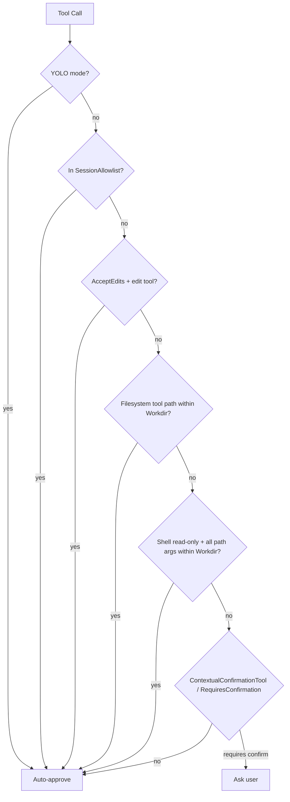

# Permission Auto-Approval

## Design goals

nano-agent reduces repeated confirmations for clearly safe operations inside the agent working directory while still requiring approval for paths outside that trusted root.

## Trusted root

The only trusted root is the `WorkingDir` resolved when the agent starts. Relative paths are resolved from this directory. Symlinks are resolved where possible before comparing paths.

## Decision chain

## Shell commands

Read-only shell commands such as `grep`, `rg`, `ls`, and `find` are auto-approved only when every argument that looks like a filesystem path is inside `WorkingDir`. For example, `grep TODO src/` is auto-approved, but `grep TODO /etc/hosts` still requires confirmation.

## Filesystem tools

Filesystem edit tools such as `write_file`, `edit_file`, and `delete_file` are auto-approved when their target path is inside `WorkingDir`. Paths outside the working directory continue through the normal confirmation flow.

## Always allow

When a caller uses the V2 approval handler and returns `ApprovalApproveAlways`, nano-agent adds allowlist rules for the approved tool call to the session allowlist. `ApprovalApproveOnce` does not update the allowlist.

## Configuration

No new configuration is introduced. Auto-approval is derived from the agent `WorkingDir` only.

## Differences from Claude Code

This implementation does not support `additionalWorkingDirectories`, and it does not persist session allowlist updates beyond the current session.
