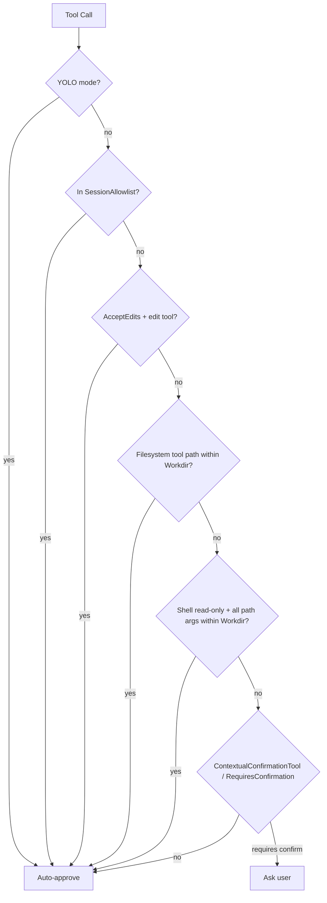

# 权限自动批准

[English](./PERMISSION_AUTO_APPROVAL.md)

## 设计目标

nano-agent 对 agent 工作目录内明确安全的操作减少重复确认，同时对位于该受信任根目录之外的路径仍然要求批准。

## 受信任根目录

唯一的受信任根目录是 agent 启动时解析得到的 `WorkingDir`。相对路径均从该目录解析。在比较路径之前，会尽可能先解析符号链接。

## 决策链

## Shell 命令

诸如 `grep`、`rg`、`ls` 和 `find` 之类的只读 shell 命令，只有当每个看起来像文件系统路径的参数都位于 `WorkingDir` 之内时才会被自动批准。例如，`grep TODO src/` 会被自动批准，但 `grep TODO /etc/hosts` 仍然需要确认。

## 文件系统工具

诸如 `write_file`、`edit_file` 和 `delete_file` 之类的文件系统编辑工具，当其目标路径位于 `WorkingDir` 之内时会被自动批准。工作目录之外的路径仍会走正常的确认流程。

## 始终允许

当调用方使用 V2 批准处理器并返回 `ApprovalApproveAlways` 时，nano-agent 会将针对该已批准工具调用的允许列表规则添加到会话允许列表中。`ApprovalApproveOnce` 不会更新允许列表。

## 配置

本功能未引入任何新的配置项。自动批准仅依据 agent 的 `WorkingDir` 推导得出。

## 与 Claude Code 的差异

本实现不支持 `additionalWorkingDirectories`，也不会将本会话中对允许列表的更新持久化到当前会话之外。
