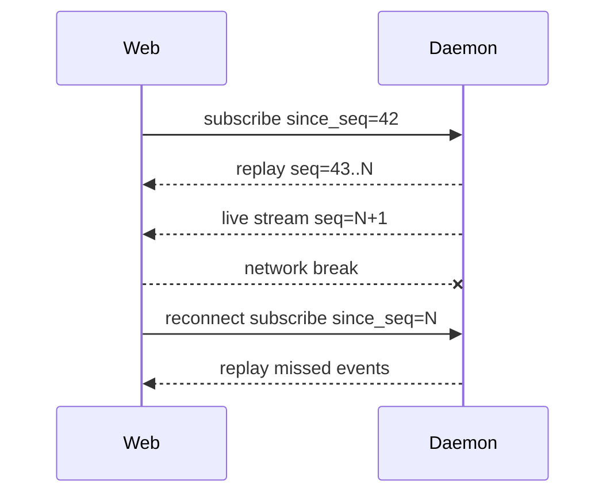
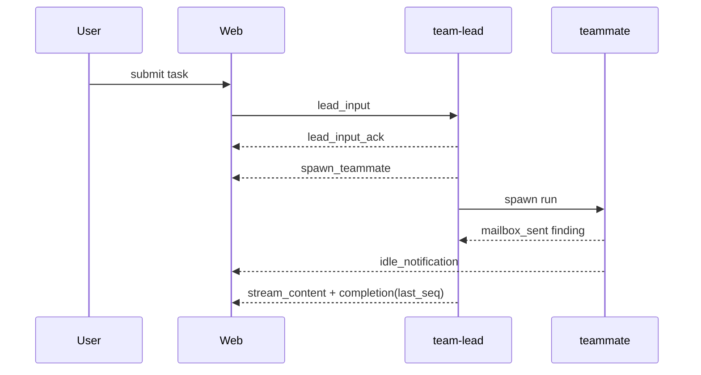

# Nano Agent Daemon API（Web 客户端实现指南）

## 0. 阅读指南

本文面向 Web/桌面客户端实现者，描述 nano daemon 的 REST 与 WebSocket 协议。当前版本为 v5，覆盖 daemon 模式新增的模型发现、MCP、命令、记忆、监控、会话生命周期、team-lead 与 scheduler API。自动化场景优先使用 `nano daemon execute --json`；交互式 UI 建议通过 WebSocket 消费事件流。


## Binary engine contract

For orchestrators that do not need a long-lived daemon, use `nano binary exec`. It accepts prompt args, or reads the prompt from stdin when args are omitted:

```bash
cat prompt.txt | nano binary exec
nano binary exec < prompt.txt
```

Binary mode appends a `<<<NANO_RESULT>>>` JSON summary by default and supports `NANO_BINARY_RESULT_FORMAT=plain|json|both`, semantic exit codes, `--sandbox=auto|on|off`, and `--on-exit-cmd`. See `docs/integration/EMBED_AS_ENGINE.md` for the full embedding contract.

## 1. 协议总览

| 项 | 说明 |
|---|---|
| Base URL | `http://HOST:PORT/api/v1` |
| Public health | `GET /health` 与 `GET /api/v1/health` 均可用 |
| WebSocket | `ws://HOST:PORT/api/v1/stream` 或 `/api/v1/teams/sessions/{id}/stream` |
| REST 鉴权 | 配置 API Key 时，使用 `X-API-Key: KEY` 或 `Authorization: Bearer KEY` |
| WebSocket 鉴权 | `?api_key=`、`?apikey=`、`?apiKey=`、`?key=`、`X-API-Key`、`Authorization: Bearer/ApiKey KEY` |
| 编码 | UTF-8 JSON |
| 错误 | JSON handler 返回 `{ "error": "message" }` 或 `{ "success": false, "error": "message" }`；部分旧 handler 仍可能返回纯文本 `http.Error` |
| 限流/重试 | 对 HTTP 429/503、网络超时、WebSocket 异常关闭实现指数退避：1s/2s/5s/10s/30s，封顶 30s |

## 2. REST API 路由总表

| Method | Path | 鉴权 | 幂等性 | 用途 |
|---|---|---:|---:|---|
| GET | `/health` | 否 | 是 | 根路径健康检查 |
| GET | `/api/v1/health` | 否 | 是 | API 健康检查 |
| GET | `/api/v1/status` | 是 | 是 | daemon/agent 状态 |
| GET | `/api/v1/models` | 是 | 是 | 列出已知模型提供商预设 |
| GET | `/api/v1/models/doctor` | 是 | 是 | 检查当前模型配置归属与识别结果 |
| GET | `/api/v1/model/routes` | 是 | 是 | 列出当前配置的模型路由与健康状态 |
| GET | `/api/v1/events?since_seq=N` | 是 | 是 | 查询 active task / team session 事件 |
| GET | `/api/v1/audit?since_seq=N` | 是 | 是 | 查询 sandbox、审批、权限和错误审计事件 |
| GET | `/api/v1/mcp/status` | 是 | 是 | MCP 开关、连接、资源、提示与工具统计 |
| GET | `/api/v1/mcp/tools` | 是 | 是 | 列出 MCP 工具 |
| GET | `/api/v1/mcp/diagnostics` | 是 | 是 | MCP 诊断占位信息 |
| GET | `/api/v1/commands` | 是 | 是 | 列出 slash commands |
| GET | `/api/v1/memory` | 是 | 是 | 搜索/列出记忆 |
| POST | `/api/v1/memory` | 是 | 否 | 保存记忆 |
| GET | `/api/v1/memory/{key}` | 是 | 是 | 按 key 搜索记忆 |
| DELETE | `/api/v1/memory/{key}` | 是 | 是 | 删除 key-value 记忆 |
| GET | `/api/v1/metrics` | 是 | 是 | 当前系统与性能指标 |
| GET | `/api/v1/metrics/history?limit=N` | 是 | 是 | 指标历史 |
| GET | `/api/v1/system/health` | 是 | 是 | 系统健康状态 |
| GET | `/api/v1/sessions?limit=N` | 是 | 是 | 列出普通会话/任务历史 |
| GET | `/api/v1/sessions/stats` | 是 | 是 | 会话状态统计与生命周期指标 |
| GET | `/api/v1/sessions/{id}` | 是 | 是 | 查看普通会话详情 |
| DELETE | `/api/v1/sessions/{id}` | 是 | 是 | 删除普通会话 |
| GET | `/api/v1/sessions/{id}/context/status` | 是 | 是 | 查看会话上下文状态 |
| GET | `/api/v1/sessions/{id}/state` | 是 | 是 | 查看会话生命周期状态 |
| PUT | `/api/v1/sessions/{id}/state` | 是 | 是 | 设置会话生命周期状态 |
| POST | `/api/v1/sessions/{id}/resume` | 是 | 是 | 从增量存储恢复事件 |
| POST | `/api/v1/sessions/{id}/execute` | 是 | 否 | 同步/异步执行普通会话任务 |
| POST | `/api/v1/sessions/{id}/cancel` | 是 | 是 | 取消普通会话当前任务 |
| POST | `/api/v1/sessions/reset` | 是 | 是 | 重置普通会话历史与元数据 |
| GET | `/api/v1/teams/sessions` | 是 | 是 | 列出 team-lead 会话 |
| POST | `/api/v1/teams/sessions` | 是 | 是 | 创建/恢复 team-lead 会话 |
| GET | `/api/v1/teams/sessions/{id}` | 是 | 是 | 查看 team-lead 会话 |
| DELETE | `/api/v1/teams/sessions/{id}` | 是 | 是 | 删除 team-lead 会话 |
| POST | `/api/v1/teams/sessions/{id}/execute` | 是 | 否 | HTTP 同步执行 team-lead 输入 |
| POST | `/api/v1/teams/sessions/{id}/cancel` | 是 | 是 | 取消 team-lead 活跃任务 |
| GET | `/api/v1/teams/sessions/{id}/events?since_seq=N` | 是 | 是 | HTTP poll 续传 team-lead 事件 |
| POST | `/api/v1/scheduler/tasks` | 是 | 否 | 创建 cron task |
| GET | `/api/v1/scheduler/tasks` | 是 | 是 | 列出 cron tasks |
| DELETE | `/api/v1/scheduler/tasks/{id}` | 是 | 是 | 删除 cron task |

`/api/v1/teams/*` 仅在 team-lead registry 初始化后注册；`/api/v1/scheduler/*` 在 scheduler 未启用时返回 503。

## 3. REST API 详解

### 3.1 Health / Status

```bash
curl http://127.0.0.1:8080/api/v1/health
curl -H "X-API-Key: $NANO_API_KEY" http://127.0.0.1:8080/api/v1/status
```

```ts
export interface HealthResponse { status: 'healthy' | string; timestamp: number; version: string; uptime: number }
export interface StatusResponse { agent_status: string; mcp_enabled: boolean; memory_size: number; active_tools: number }
```

### 3.2 Models

```bash
curl -H "X-API-Key: $NANO_API_KEY" http://127.0.0.1:8080/api/v1/models
curl -H "X-API-Key: $NANO_API_KEY" http://127.0.0.1:8080/api/v1/models/doctor
curl -H "X-API-Key: $NANO_API_KEY" http://127.0.0.1:8080/api/v1/model/routes
```

```ts
export interface ModelsResponse { providers: unknown[] }
export interface ModelDoctorResponse { configured_model: unknown; provider: string; base_url: string; known: boolean }
export interface ModelRouteInfo {
  name: string;
  provider: string;
  model: string;
  base_url: string;
  profile: string;
  breaker_state: 'closed' | 'open' | 'half_open' | 'unavailable';
  metrics: Record<string, unknown>;
}
export type ModelRoutesResponse = ModelRouteInfo[];
```

`/models` 返回内置 provider presets；`/models/doctor` 根据当前 `base_url` 与 `model` 推断 provider，适合设置页诊断；`/model/routes` 返回当前配置的模型路由列表及其熔断器状态与健康指标，适合监控与故障排查。

### 3.3 MCP

```bash
curl -H "X-API-Key: $NANO_API_KEY" http://127.0.0.1:8080/api/v1/mcp/status
curl -H "X-API-Key: $NANO_API_KEY" http://127.0.0.1:8080/api/v1/mcp/tools
curl -H "X-API-Key: $NANO_API_KEY" http://127.0.0.1:8080/api/v1/mcp/diagnostics
```

```ts
export interface MCPStatusResponse {
  enabled: boolean;
  servers: number | unknown;
  tools: number;
  connections: unknown[];
  resources: number | unknown;
  prompts: number | unknown;
}
export interface MCPToolsResponse { tools: Array<{ name: string; description?: string; server: string; connected: boolean }> }
export interface MCPDiagnosticsResponse { status: string; servers: unknown[]; metrics: Record<string, unknown> }
```

### 3.4 Slash commands

```bash
curl -H "X-API-Key: $NANO_API_KEY" http://127.0.0.1:8080/api/v1/commands
```

```ts
export interface CommandInfo {
  name: string;
  description: string;
  usage: string;
  category: string;
  source: string;
  namespace?: string;
  allowedTools?: string[];
  permissionProfile?: string;
  prelude?: string[];
  preludeTimeoutSeconds?: number;
  preludeOnError?: 'continue' | 'abort';
  preludeOutput?: 'none' | 'summary' | 'full';
}
export interface CommandsResponse { commands: CommandInfo[] }
```

daemon 有 agent 工作目录时返回项目命令与内置命令；否则只返回内置命令，避免意外访问 daemon 进程 home 目录。

### 3.5 Events and audit

```bash
curl -H "X-API-Key: $NANO_API_KEY" 'http://127.0.0.1:8080/api/v1/events?session_id=sess_123&since_seq=42&limit=200'
curl -H "X-API-Key: $NANO_API_KEY" 'http://127.0.0.1:8080/api/v1/audit?sandbox=true&limit=100'
```

Query parameters:

- `session_id` / `session`
- `run_id`
- `type`
- `sandbox=true`
- `since_seq` / `since`
- `limit` (default `200`, max `1000`)

`/events` returns stored events from active task and team session stores. `/audit` applies an audit filter for sandbox, approval, permission-decision metadata, and error events.

### 3.6 Memory

```bash
curl -H "X-API-Key: $NANO_API_KEY" http://127.0.0.1:8080/api/v1/memory
curl -X POST -H "X-API-Key: $NANO_API_KEY" -H 'Content-Type: application/json' \
  -d '{"key":"release-note","content":"Prefer daemon WebSocket for UI","category":"Docs","tags":["daemon"],"priority":"medium"}' \
  http://127.0.0.1:8080/api/v1/memory
curl -H "X-API-Key: $NANO_API_KEY" http://127.0.0.1:8080/api/v1/memory/release-note
curl -X DELETE -H "X-API-Key: $NANO_API_KEY" http://127.0.0.1:8080/api/v1/memory/release-note
```

```ts
export interface MemoryListResponse { entries: unknown[]; count: number }
export interface MemorySaveRequest { key: string; content: string; category?: string; tags?: string[]; priority?: string }
export interface MemorySaveResponse { success: boolean; key: string; message?: string }
export interface MemoryGetResponse { key: string; content: string; found: boolean }
export interface MemoryDeleteResponse { success: boolean; key: string; error?: string }
```

### 3.6 Metrics / System health

```bash
curl -H "X-API-Key: $NANO_API_KEY" http://127.0.0.1:8080/api/v1/metrics
curl -H "X-API-Key: $NANO_API_KEY" 'http://127.0.0.1:8080/api/v1/metrics/history?limit=50'
curl -H "X-API-Key: $NANO_API_KEY" http://127.0.0.1:8080/api/v1/system/health
```

```ts
export interface MetricsResponse { system: unknown; performance: unknown; timestamp: number }
export interface MetricsHistoryResponse { system_history: unknown[]; performance_history: unknown[]; count: number; timestamp: number }
export type SystemHealthResponse = Record<string, unknown>;
```

### 3.7 Sessions

```bash
curl -H "X-API-Key: $NANO_API_KEY" 'http://127.0.0.1:8080/api/v1/sessions?limit=200'
curl -H "X-API-Key: $NANO_API_KEY" http://127.0.0.1:8080/api/v1/sessions/stats
curl -H "X-API-Key: $NANO_API_KEY" http://127.0.0.1:8080/api/v1/sessions/web-1
curl -X POST -H "X-API-Key: $NANO_API_KEY" -H 'Content-Type: application/json' \
  -d '{"command":"hello","timeout":120,"include_steps":true,"async":false}' \
  http://127.0.0.1:8080/api/v1/sessions/web-1/execute
curl -X POST -H "X-API-Key: $NANO_API_KEY" http://127.0.0.1:8080/api/v1/sessions/web-1/cancel
curl -X POST -H "X-API-Key: $NANO_API_KEY" -H 'Content-Type: application/json' \
  -d '{"session_id":"web-1"}' http://127.0.0.1:8080/api/v1/sessions/reset
```

```ts
export interface MultimodalImage { url?: string; base64?: string; mime_type?: string }
export interface ExecuteRequest { command: string; timeout?: number; include_steps?: boolean; async?: boolean; images?: MultimodalImage[] }
export interface ExecuteResponse {
  success: boolean;
  result?: string;
  error?: string;
  steps?: StreamEvent[];
  token_stats?: TokenStats | null;
  session_id?: string;
  run_id?: string;
  status?: string;
  completed?: boolean;
  message?: string;
}
export interface SessionSummary {
  id: string;
  type?: string;
  title?: string;
  created_at?: string;
  last_active_at?: string;
  status?: string;
  stored?: boolean;
  active?: boolean;
  total_tokens?: number;
  duration?: number;
  message_count?: number;
}
export interface SessionsListResponse { success: boolean; sessions: SessionSummary[] }
export interface SessionDetailResponse {
  success: boolean;
  id: string;
  created_at: string;
  last_active_at: string;
  state: string;
  state_changed_at: string;
  last_persisted_seq: number;
  last_compaction_seq: number;
  metadata: Record<string, unknown>;
  history: unknown[];
}
export interface SessionsStatsResponse {
  active: number;
  idle: number;
  awaiting_input: number;
  suspended: number;
  terminated: number;
  cleanup_reasons: Record<string, number>;
  total_loaded: number;
  total_persisted_seq_lag_p99: number;
  avg_session_lifetime_ms: number;
}
```

`GET /sessions?limit=N` 默认 `limit=200`，最大接受 `2000`。`POST /sessions/{id}/execute` 在 `async=true` 时立即返回 `run_id/status=running`；否则等待完成、错误或超时，并可在 `include_steps=true` 时返回事件步骤。

### 3.8 Session lifecycle / context / resume

```bash
curl -H "X-API-Key: $NANO_API_KEY" http://127.0.0.1:8080/api/v1/sessions/web-1/context/status
curl -H "X-API-Key: $NANO_API_KEY" http://127.0.0.1:8080/api/v1/sessions/web-1/state
curl -X PUT -H "X-API-Key: $NANO_API_KEY" -H 'Content-Type: application/json' \
  -d '{"state":"suspended","reason":"user_pause"}' \
  http://127.0.0.1:8080/api/v1/sessions/web-1/state
curl -X POST -H "X-API-Key: $NANO_API_KEY" -H 'Content-Type: application/json' \
  -d '{"from_seq":42}' \
  http://127.0.0.1:8080/api/v1/sessions/web-1/resume
```

```ts
export type SessionState = 'active' | 'idle' | 'awaiting_input' | 'suspended' | 'terminated' | string;
export interface SessionContextStatusResponse { session_id: string; context: unknown }
export interface SessionStateResponse { session_id: string; state: SessionState; state_changed_at: string }
export interface SetSessionStateRequest { state: SessionState; reason?: string }
export interface SetSessionStateResponse { success: boolean; session_id: string; state: SessionState }
export interface SessionResumeRequest { from_seq?: number }
export interface SessionResumeResponse { session_id: string; from_seq: number; events: unknown[] }
```

`/resume` 依赖 `IncrementalSessionStorage`；存储不支持时返回 HTTP 501。

### 3.9 Team-lead sessions

```bash
curl -X POST -H "X-API-Key: $NANO_API_KEY" -H 'Content-Type: application/json' \
  -d '{"session_id":"lead-alpha-chat","team_name":"alpha","interactive_confirm":true}' \
  http://127.0.0.1:8080/api/v1/teams/sessions
curl -H "X-API-Key: $NANO_API_KEY" http://127.0.0.1:8080/api/v1/teams/sessions
curl -H "X-API-Key: $NANO_API_KEY" http://127.0.0.1:8080/api/v1/teams/sessions/lead-alpha-chat
curl -X POST -H "X-API-Key: $NANO_API_KEY" -H 'Content-Type: application/json' \
  -d '{"command":"summarize mailbox"}' \
  http://127.0.0.1:8080/api/v1/teams/sessions/lead-alpha-chat/execute
curl -H "X-API-Key: $NANO_API_KEY" \
  'http://127.0.0.1:8080/api/v1/teams/sessions/lead-alpha-chat/events?since_seq=42'
curl -X POST -H "X-API-Key: $NANO_API_KEY" http://127.0.0.1:8080/api/v1/teams/sessions/lead-alpha-chat/cancel
```

```ts
export interface CreateTeamLeadSessionRequest { session_id?: string; team_name?: string; interactive_confirm?: boolean }
export interface TeamLeadSessionResponse { session_id: string; team_name: string; created_at: string; last_active_at: string }
export interface TeamLeadSessionsListResponse { sessions: TeamLeadSessionResponse[]; count: number }
export interface ExecuteInTeamLeadSessionRequest { command: string }
export interface ExecuteInTeamLeadSessionResponse { success: boolean; events: StreamEvent[]; error?: string }
export interface TeamLeadEventsResponse { session_id: string; since_seq: number; last_seq: number; events: StreamEvent[] }
export interface TeamLeadCancelResponse { success: boolean; cancelled_tasks: number }
```

`POST /teams/sessions` 未提供 `team_name` 时默认 `default`；未提供 `session_id` 时 daemon 自动生成。`interactive_confirm=true` 会让 team-lead 工具调用进入交互审批流程。

### 3.10 Scheduler

```bash
curl -X POST -H "X-API-Key: $NANO_API_KEY" -H 'Content-Type: application/json' \
  -d '{"cron_expression":"0 */2 * * *","command":"generate status report"}' \
  http://127.0.0.1:8080/api/v1/scheduler/tasks
curl -H "X-API-Key: $NANO_API_KEY" http://127.0.0.1:8080/api/v1/scheduler/tasks
curl -X DELETE -H "X-API-Key: $NANO_API_KEY" http://127.0.0.1:8080/api/v1/scheduler/tasks/task-id
```

```ts
export interface ScheduleTaskRequest { cron_expression: string; command: string }
export interface ScheduleTaskResponse { success: boolean; task?: unknown; error?: string }
export interface ListTasksResponse { success: boolean; tasks: unknown[] }
export interface DeleteTaskResponse { success: boolean; error?: string }
```

## 4. WebSocket 协议

### 4.1 连接建立

普通会话连接 `/api/v1/stream`，发送 `subscribe` 帧指定 `session_id` 续传已有任务，或发送带 `command` 的帧启动/附着会话任务。Team-lead 会话连接 `/api/v1/teams/sessions/{id}/stream`，可发送 `subscribe` 续传，也可发送 `lead_input` 启动一次 team-lead turn。

### 4.2 Client → Server 帧

| type | 连接 | 关键字段 | 说明 |
|---|---|---|---|
| `subscribe` | 普通/team | `session_id?`, `run_id?`, `since_seq?`, `streams?` | 订阅并从 `since_seq` 后续传；普通连接必须提供 `session_id` |
| `command` 或空 type + `command` | 普通 | `session_id`, `command`, `timeout?`, `images?` | 启动普通会话任务；如果已有 running task 会自动附着并忽略新命令 |
| `lead_input` | team | `command`, `task_id?`, `since_seq?` | 启动 team-lead 输入；`task_id` 为空时自动生成 |
| `replay` | team | `since_seq?` | 只回放 `since_seq` 后的 team-lead 事件，完成后返回 `replay_complete`，不进入 live 订阅 |
| `tool_approval` | 普通/team | `call_id`, `approved` | 提交工具审批结果 |
| `approve` / `reject` | team | `call_id` | `tool_approval` 的 team-lead 兼容别名 |
| `cancel` | team | - | 取消 team-lead 活跃任务并返回 `cancel_ack` |
| `ping` | 普通/team | - | 返回 `pong` |

```json
{ "type": "subscribe", "session_id": "web-1", "run_id": "run_abc", "since_seq": 42, "streams": ["default"] }
{ "type": "command", "session_id": "web-1", "command": "hello", "timeout": 120 }
{ "type": "lead_input", "command": "summarize mailbox", "task_id": "task_1", "since_seq": 42 }
{ "type": "replay", "since_seq": 42 }
{ "type": "tool_approval", "call_id": "call_1", "approved": true }
{ "type": "approve", "call_id": "call_1" }
{ "type": "cancel" }
{ "type": "ping" }
```

```ts
export type ClientFrame = SubscribeFrame | CommandFrame | LeadInputFrame | ReplayFrame | ToolApprovalFrame | ToolApprovalAliasFrame | CancelFrame | PingFrame;
export interface SubscribeFrame { type: 'subscribe'; session_id?: string; run_id?: string; since_seq?: number; streams?: string[] }
export interface CommandFrame { type?: 'command'; session_id: string; command: string; timeout?: number; images?: MultimodalImage[] }
export interface LeadInputFrame { type: 'lead_input'; command: string; task_id?: string; since_seq?: number }
export interface ReplayFrame { type: 'replay'; since_seq?: number }
export interface ToolApprovalFrame { type: 'tool_approval'; call_id: string; approved: boolean }
export interface ToolApprovalAliasFrame { type: 'approve' | 'reject'; call_id: string }
export interface CancelFrame { type: 'cancel' }
export interface PingFrame { type: 'ping' }
```

### 4.3 Server → Client 帧

| type | 连接 | 说明 |
|---|---|---|
| `session_start` | team | team-lead replay/live stream 开始 |
| `replay_complete` | team | `replay` 帧回放结束，包含 `since_seq/last_seq/count` |
| `lead_input_ack` | team | team-lead 接收输入，包含 `session_id/team_name/task_id` |
| `cancel_ack` | team | team-lead cancel 已处理，包含 `cancelled_tasks` |
| `tool_approval_ack` | 普通/team | 审批结果已提交 |
| `status` | 普通 | 未提供 command/subscribe 时返回会话当前 `status/title/updated_at` |
| `stream_content` / `content` | 普通/team | assistant 文本流/完成态文本 |
| `thinking` | 普通/team | 可折叠思考块 |
| `tool_use` / `tool_call` / `tool_result` | 普通/team | 工具调用与结果 |
| `waiting_for_user` / `tool_approval_request` | 普通/team | 工具审批请求 |
| `mailbox_sent` | team | 团队邮箱动态 |
| `idle_notification` | team | teammate 状态摘要 |
| `spawn_teammate` | team | teammate/专家被拉起 |
| `token_stats` | 普通/team | token 统计 |
| `completion` / `done` | 普通/team | turn 完成；`completion` 包含 `last_seq` |
| `pong` | 普通/team | 心跳响应 |
| `chunk` | 普通/team | 大消息分片 |
| `error` | 普通/team | 错误帧，通常包含 `error` 与可选 `severity` |

```json
{ "type":"lead_input_ack", "session_id":"lead-alpha-chat", "team_name":"alpha", "task_id":"task_1" }
{ "type":"replay_complete", "session_id":"lead-alpha-chat", "since_seq":42, "last_seq":55, "count":13 }
{ "type":"tool_approval_ack", "session_id":"lead-alpha-chat", "call_id":"call_1", "approved":true }
{ "type":"cancel_ack", "session_id":"lead-alpha-chat", "cancelled_tasks":1 }
{ "type":"status", "session_id":"web-1", "status":"completed", "title":"hello", "updated_at":"2026-04-29T09:27:50Z" }
{ "type":"completion", "session_id":"web-1", "run_id":"run_abc", "success":true, "status":"completed", "session_done":true, "last_seq":55 }
```

### 4.4 工具审批

工具审批请求可能以 `tool_approval_request` 直接发送，也可能以 `waiting_for_user` 事件携带 `metadata.kind=tool_approval_request` 的形式出现。客户端收到审批请求后应阻塞该工具调用的 UI 决策，但不阻塞 WebSocket 读循环；用户选择后发送 `tool_approval`。Team-lead stream 也接受 `approve` / `reject` 作为显式别名，便于 UI 将按钮动作直接映射为 frame。

```json
{ "type":"tool_approval_request", "call_id":"call_1", "tool_name":"Bash", "parameters":{"command":"git status"}, "timeout_seconds":60 }
{ "type":"tool_approval", "call_id":"call_1", "approved":true }
{ "type":"reject", "call_id":"call_2" }
```

```ts
export interface ToolApprovalRequestFrame {
  type: 'tool_approval_request' | 'waiting_for_user';
  call_id?: string;
  tool_name?: string;
  parameters?: Record<string, unknown>;
  timeout_seconds?: number;
  metadata?: Record<string, unknown>;
}
export interface ToolApprovalAckFrame { type: 'tool_approval_ack'; session_id?: string; call_id: string; approved: boolean }
```

### 4.5 大消息分片

```json
{ "type":"chunk", "id":"msg_1", "index":0, "total":3, "data":"...", "is_chunk":true, "complete":false }
```

客户端按 `id` 收集 `index`，达到 `total` 后按序拼接 `data` 并重新解析 JSON。

### 4.6 重连与续传

客户端必须持久化最大 `seq` 或 `completion.last_seq`，断线后将该值作为 `since_seq` 恢复；`since_seq` 是排他下界，daemon 只回放 `seq > since_seq` 的事件。



### 4.7 心跳

客户端每 30s 发送 `ping`，90s 未收到任何消息应断开并重连。普通流 server read deadline 约 300s；team-lead stream 使用独立 read timeout。

## 5. 事件类型枚举

| StreamEvent.type | WS 发送 | Web UI 建议 |
|---|---:|---|
| `session_start` | 是 | 标记 replay/live stream 开始 |
| `lead_input_ack` | 是 | 将提交按钮切到运行态并记录 task_id |
| `stream_content` | 是 | 追加 assistant 流式文本 |
| `content` | 是 | 完成态 assistant 文本 |
| `thinking` | 是 | 可折叠思考块 |
| `tool_use` | 是 | 工具调用卡片 |
| `tool_call` / `tool_result` | 是 | 调试/详细步骤 |
| `waiting_for_user` / `tool_approval_request` | 是 | 审批 UI |
| `tool_approval_ack` | 是 | 清理审批等待态 |
| `mailbox_sent` | 是 | 团队动态 |
| `idle_notification` | 是 | teammate 状态 |
| `spawn_teammate` | 是 | roster 更新 |
| `status` | 是 | 会话概览/标题刷新 |
| `error` | 是 | 错误提示 |
| `completion` / `done` | 是 | 标记 turn 完成并保存 `last_seq` |
| `token_stats` | 是 | 状态栏 token 统计 |
| `cancel_ack` | 是 | 取消操作反馈 |
| `pong` | 是 | 心跳响应 |
| `chunk` | 是 | 分片重组 |

## 6. Swarm / Team-Lead 流程



## 7. 错误码表

| 层级 | 示例 | 处理建议 |
|---|---|---|
| HTTP 400 | invalid JSON / invalid request body / command required | 修正请求 |
| HTTP 401/403 | invalid API key | 重新鉴权 |
| HTTP 404 | session not found / task not found | 创建或恢复会话 |
| HTTP 409 | run mismatch / task not running | 重新订阅最新 run 或刷新状态 |
| HTTP 422 | cannot cancel this session | 刷新任务状态，禁用取消按钮 |
| HTTP 501 | incremental storage unavailable / memory delete not implemented | 降级隐藏相关能力 |
| HTTP 503 | daemon draining / scheduler disabled / team-lead disabled | 展示不可用状态并退避重试 |
| HTTP 5xx | daemon error | 退避重试 |
| WS close 1006 | abnormal close | reconnect with since_seq |
| WS error frame | `{type:'error'}` | 展示并按 severity 决定是否重试 |

## 8. TypeScript 类型定义汇总

```ts
export interface TokenStats { input_tokens: number; output_tokens: number; total_tokens: number; peak_tokens_per_second?: number }
export interface StreamEvent {
  type: string;
  content?: string;
  error?: string;
  source?: string;
  seq?: number;
  session_id?: string;
  metadata?: Record<string, unknown>;
  token_stats?: TokenStats;
  [key: string]: unknown;
}
export interface ChunkFrame { type: 'chunk'; id: string; index: number; total: number; data: string; is_chunk: true; complete?: boolean }
export interface CompletionFrame {
  type: 'completion';
  session_id: string;
  run_id?: string;
  team_name?: string;
  task_id?: string;
  success: boolean;
  status: string;
  session_done: boolean;
  last_seq: number;
  token_stats?: TokenStats | null;
}
export type ServerFrame = StreamEvent | ToolApprovalRequestFrame | ToolApprovalAckFrame | ChunkFrame | CompletionFrame;
```

## 9. 客户端实现 Checklist

- [ ] REST 支持 `X-API-Key` 与 `Authorization: Bearer`，WebSocket 支持 query token
- [ ] 持久化最大 `seq` 与 `completion.last_seq`
- [ ] 断线用最后已收到的序号作为 `since_seq` 续传，普通流可带 `run_id` 防止串 run
- [ ] 指数退避并封顶 30s
- [ ] chunk 重组后再解析
- [ ] ping/pong 心跳与超时
- [ ] 审批 UI 不阻塞读循环，并处理 `tool_approval_ack`
- [ ] cancel/reset/sessions 走 REST 或控制帧
- [ ] 对未启用 team-lead/scheduler/incremental storage 的 503/501 做能力降级
- [ ] 未知事件以 warning 记录，不崩溃

## 10. 兼容性与版本

v5 在 v4 Web 客户端指南基础上补齐 daemon 模式新增 REST API：`models`、`models/doctor`、`model/routes`（模型路由与熔断器健康状态）、`mcp`、`commands`、`memory`、`metrics`、`system/health`、session stats/context/state/resume、team-lead get/delete/execute/cancel/events 与 scheduler tasks；WebSocket 文档同步补充 `lead_input_ack`、`cancel_ack`、`tool_approval_ack`、`status`、`completion.last_seq`、`images` 与当前鉴权方式。

v4 破坏性变更：删除旧 Adapter `SendEvent/SubmitChannel/CancelChannel`；删除 `lead-chat --plain` 与 readline 纯文本输出；删除 daemon stream-exec 的 `fmt.Print` 渲染分支；脚本应迁移到 `nano daemon execute --json`。

## 11. 附录

```bash
wscat -c 'ws://127.0.0.1:8080/api/v1/stream?api_key=KEY'
> {"type":"command","session_id":"web-1","command":"hello"}
> {"type":"subscribe","session_id":"web-1","since_seq":0}
> {"type":"ping"}

wscat -c 'ws://127.0.0.1:8080/api/v1/teams/sessions/lead-alpha-chat/stream?api_key=KEY'
> {"type":"subscribe","since_seq":0}
> {"type":"lead_input","command":"hello","since_seq":0}
> {"type":"cancel"}
```

CLI 对应关系：`nano chat` 使用本地 EventSource；`nano chat --daemon` 与 `nano lead-chat` 使用 daemon WebSocket；`nano daemon execute --json` 使用同步 HTTP，适合 CI。
