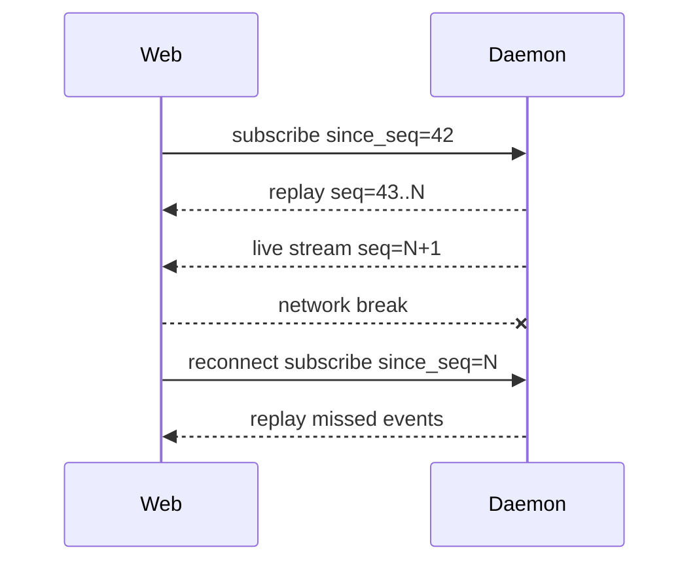
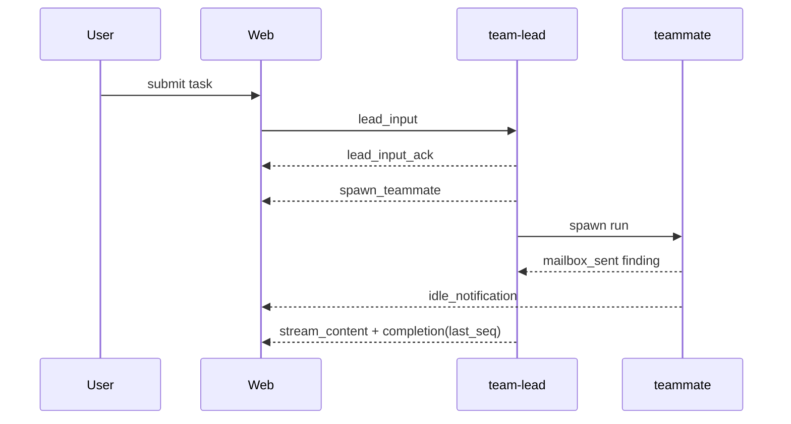

# Nano Agent Daemon API (Web Client Implementation Guide)

[中文](./DAEMON_API.zh-CN.md)

## 0. Reading guide

This document is for Web/desktop client implementers and describes the REST and WebSocket protocols of the nano daemon. The current version is v5, covering the daemon-mode additions for model discovery, MCP, commands, memory, monitoring, session lifecycle, team-lead, and scheduler APIs. For automation scenarios, prefer `nano daemon execute --json`; for interactive UIs, consume the event stream over WebSocket.


## Binary engine contract

For orchestrators that do not need a long-lived daemon, use `nano binary exec`. It accepts prompt args, or reads the prompt from stdin when args are omitted:

```bash
cat prompt.txt | nano binary exec
nano binary exec < prompt.txt
```

Binary mode appends a `<<<NANO_RESULT>>>` JSON summary by default and supports `NANO_BINARY_RESULT_FORMAT=plain|json|both`, semantic exit codes, `--sandbox=auto|on|off`, and `--on-exit-cmd`. See `docs/integration/EMBED_AS_ENGINE.md` for the full embedding contract.

## 1. Protocol overview

| Item | Description |
|---|---|
| Base URL | `http://HOST:PORT/api/v1` |
| Public health | Both `GET /health` and `GET /api/v1/health` are available |
| WebSocket | `ws://HOST:PORT/api/v1/stream` or `/api/v1/teams/sessions/{id}/stream` |
| REST auth | When an API key is configured, use `X-API-Key: KEY` or `Authorization: Bearer KEY` |
| WebSocket auth | `?api_key=`, `?apikey=`, `?apiKey=`, `?key=`, `X-API-Key`, `Authorization: Bearer/ApiKey KEY` |
| Encoding | UTF-8 JSON |
| Errors | JSON handlers return `{ "error": "message" }` or `{ "success": false, "error": "message" }`; some legacy handlers may still return plain-text `http.Error` |
| Rate limiting / retry | Implement exponential backoff for HTTP 429/503, network timeouts, and abnormal WebSocket closures: 1s/2s/5s/10s/30s, capped at 30s |

## 2. REST API route summary

| Method | Path | Auth | Idempotent | Purpose |
|---|---|---:|---:|---|
| GET | `/health` | No | Yes | Root-path health check |
| GET | `/api/v1/health` | No | Yes | API health check |
| GET | `/api/v1/status` | Yes | Yes | daemon/agent status |
| GET | `/api/v1/models` | Yes | Yes | List known model provider presets |
| GET | `/api/v1/models/doctor` | Yes | Yes | Inspect the attribution and recognition of the current model configuration |
| GET | `/api/v1/model/routes` | Yes | Yes | List currently configured model routes and their health status |
| GET | `/api/v1/events?since_seq=N` | Yes | Yes | Query active task / team session events |
| GET | `/api/v1/audit?since_seq=N` | Yes | Yes | Query sandbox, approval, permission, and error audit events |
| GET | `/api/v1/mcp/status` | Yes | Yes | MCP switch, connection, resource, prompt, and tool statistics |
| GET | `/api/v1/mcp/tools` | Yes | Yes | List MCP tools |
| GET | `/api/v1/mcp/diagnostics` | Yes | Yes | MCP diagnostics placeholder information |
| GET | `/api/v1/commands` | Yes | Yes | List slash commands |
| GET | `/api/v1/memory` | Yes | Yes | Search/list memory |
| POST | `/api/v1/memory` | Yes | No | Save memory |
| GET | `/api/v1/memory/{key}` | Yes | Yes | Search memory by key |
| DELETE | `/api/v1/memory/{key}` | Yes | Yes | Delete key-value memory |
| GET | `/api/v1/metrics` | Yes | Yes | Current system and performance metrics |
| GET | `/api/v1/metrics/history?limit=N` | Yes | Yes | Metrics history |
| GET | `/api/v1/system/health` | Yes | Yes | System health status |
| GET | `/api/v1/sessions?limit=N` | Yes | Yes | List regular session/task history |
| GET | `/api/v1/sessions/stats` | Yes | Yes | Session state statistics and lifecycle metrics |
| GET | `/api/v1/sessions/{id}` | Yes | Yes | View regular session details |
| DELETE | `/api/v1/sessions/{id}` | Yes | Yes | Delete a regular session |
| GET | `/api/v1/sessions/{id}/context/status` | Yes | Yes | View session context status |
| GET | `/api/v1/sessions/{id}/state` | Yes | Yes | View session lifecycle state |
| PUT | `/api/v1/sessions/{id}/state` | Yes | Yes | Set session lifecycle state |
| POST | `/api/v1/sessions/{id}/resume` | Yes | Yes | Resume events from incremental storage |
| POST | `/api/v1/sessions/{id}/execute` | Yes | No | Execute a regular session task synchronously/asynchronously |
| POST | `/api/v1/sessions/{id}/cancel` | Yes | Yes | Cancel the current task of a regular session |
| POST | `/api/v1/sessions/reset` | Yes | Yes | Reset regular session history and metadata |
| GET | `/api/v1/teams/sessions` | Yes | Yes | List team-lead sessions |
| POST | `/api/v1/teams/sessions` | Yes | Yes | Create/resume a team-lead session |
| GET | `/api/v1/teams/sessions/{id}` | Yes | Yes | View a team-lead session |
| DELETE | `/api/v1/teams/sessions/{id}` | Yes | Yes | Delete a team-lead session |
| POST | `/api/v1/teams/sessions/{id}/execute` | Yes | No | Execute team-lead input synchronously over HTTP |
| POST | `/api/v1/teams/sessions/{id}/cancel` | Yes | Yes | Cancel the active task of a team-lead session |
| GET | `/api/v1/teams/sessions/{id}/events?since_seq=N` | Yes | Yes | Resume team-lead events via HTTP polling |
| POST | `/api/v1/scheduler/tasks` | Yes | No | Create a cron task |
| GET | `/api/v1/scheduler/tasks` | Yes | Yes | List cron tasks |
| DELETE | `/api/v1/scheduler/tasks/{id}` | Yes | Yes | Delete a cron task |

`/api/v1/teams/*` is only registered after the team-lead registry is initialized; `/api/v1/scheduler/*` returns 503 when the scheduler is not enabled.

## 3. REST API details

### 3.1 Health / Status

```bash
curl http://127.0.0.1:8080/api/v1/health
curl -H "X-API-Key: $NANO_API_KEY" http://127.0.0.1:8080/api/v1/status
```

```ts
export interface HealthResponse { status: 'healthy' | string; timestamp: number; version: string; uptime: number }
export interface StatusResponse { agent_status: string; mcp_enabled: boolean; memory_size: number; active_tools: number }
```

### 3.2 Models

```bash
curl -H "X-API-Key: $NANO_API_KEY" http://127.0.0.1:8080/api/v1/models
curl -H "X-API-Key: $NANO_API_KEY" http://127.0.0.1:8080/api/v1/models/doctor
curl -H "X-API-Key: $NANO_API_KEY" http://127.0.0.1:8080/api/v1/model/routes
```

```ts
export interface ModelsResponse { providers: unknown[] }
export interface ModelDoctorResponse { configured_model: unknown; provider: string; base_url: string; known: boolean }
export interface ModelRouteInfo {
  name: string;
  provider: string;
  model: string;
  base_url: string;
  profile: string;
  breaker_state: 'closed' | 'open' | 'half_open' | 'unavailable';
  metrics: Record<string, unknown>;
}
export type ModelRoutesResponse = ModelRouteInfo[];
```

`/models` returns built-in provider presets; `/models/doctor` infers the provider from the current `base_url` and `model`, suitable for settings-page diagnostics; `/model/routes` returns the currently configured model routes along with their circuit-breaker state and health metrics, suitable for monitoring and troubleshooting.

### 3.3 MCP

```bash
curl -H "X-API-Key: $NANO_API_KEY" http://127.0.0.1:8080/api/v1/mcp/status
curl -H "X-API-Key: $NANO_API_KEY" http://127.0.0.1:8080/api/v1/mcp/tools
curl -H "X-API-Key: $NANO_API_KEY" http://127.0.0.1:8080/api/v1/mcp/diagnostics
```

```ts
export interface MCPStatusResponse {
  enabled: boolean;
  servers: number | unknown;
  tools: number;
  connections: unknown[];
  resources: number | unknown;
  prompts: number | unknown;
}
export interface MCPToolsResponse { tools: Array<{ name: string; description?: string; server: string; connected: boolean }> }
export interface MCPDiagnosticsResponse { status: string; servers: unknown[]; metrics: Record<string, unknown> }
```

### 3.4 Slash commands

```bash
curl -H "X-API-Key: $NANO_API_KEY" http://127.0.0.1:8080/api/v1/commands
```

```ts
export interface CommandInfo {
  name: string;
  description: string;
  usage: string;
  category: string;
  source: string;
  namespace?: string;
  allowedTools?: string[];
  permissionProfile?: string;
  prelude?: string[];
  preludeTimeoutSeconds?: number;
  preludeOnError?: 'continue' | 'abort';
  preludeOutput?: 'none' | 'summary' | 'full';
}
export interface CommandsResponse { commands: CommandInfo[] }
```

When the daemon has an agent working directory, both project commands and built-in commands are returned; otherwise only built-in commands are returned, to avoid accidentally accessing the daemon process home directory.

### 3.5 Events and audit

```bash
curl -H "X-API-Key: $NANO_API_KEY" 'http://127.0.0.1:8080/api/v1/events?session_id=sess_123&since_seq=42&limit=200'
curl -H "X-API-Key: $NANO_API_KEY" 'http://127.0.0.1:8080/api/v1/audit?sandbox=true&limit=100'
```

Query parameters:

- `session_id` / `session`
- `run_id`
- `type`
- `sandbox=true`
- `since_seq` / `since`
- `limit` (default `200`, max `1000`)

`/events` returns stored events from active task and team session stores. `/audit` applies an audit filter for sandbox, approval, permission-decision metadata, and error events.

### 3.6 Memory

```bash
curl -H "X-API-Key: $NANO_API_KEY" http://127.0.0.1:8080/api/v1/memory
curl -X POST -H "X-API-Key: $NANO_API_KEY" -H 'Content-Type: application/json' \
  -d '{"key":"release-note","content":"Prefer daemon WebSocket for UI","category":"Docs","tags":["daemon"],"priority":"medium"}' \
  http://127.0.0.1:8080/api/v1/memory
curl -H "X-API-Key: $NANO_API_KEY" http://127.0.0.1:8080/api/v1/memory/release-note
curl -X DELETE -H "X-API-Key: $NANO_API_KEY" http://127.0.0.1:8080/api/v1/memory/release-note
```

```ts
export interface MemoryListResponse { entries: unknown[]; count: number }
export interface MemorySaveRequest { key: string; content: string; category?: string; tags?: string[]; priority?: string }
export interface MemorySaveResponse { success: boolean; key: string; message?: string }
export interface MemoryGetResponse { key: string; content: string; found: boolean }
export interface MemoryDeleteResponse { success: boolean; key: string; error?: string }
```

### 3.6 Metrics / System health

```bash
curl -H "X-API-Key: $NANO_API_KEY" http://127.0.0.1:8080/api/v1/metrics
curl -H "X-API-Key: $NANO_API_KEY" 'http://127.0.0.1:8080/api/v1/metrics/history?limit=50'
curl -H "X-API-Key: $NANO_API_KEY" http://127.0.0.1:8080/api/v1/system/health
```

```ts
export interface MetricsResponse { system: unknown; performance: unknown; timestamp: number }
export interface MetricsHistoryResponse { system_history: unknown[]; performance_history: unknown[]; count: number; timestamp: number }
export type SystemHealthResponse = Record<string, unknown>;
```

### 3.7 Sessions

```bash
curl -H "X-API-Key: $NANO_API_KEY" 'http://127.0.0.1:8080/api/v1/sessions?limit=200'
curl -H "X-API-Key: $NANO_API_KEY" http://127.0.0.1:8080/api/v1/sessions/stats
curl -H "X-API-Key: $NANO_API_KEY" http://127.0.0.1:8080/api/v1/sessions/web-1
curl -X POST -H "X-API-Key: $NANO_API_KEY" -H 'Content-Type: application/json' \
  -d '{"command":"hello","timeout":120,"include_steps":true,"async":false}' \
  http://127.0.0.1:8080/api/v1/sessions/web-1/execute
curl -X POST -H "X-API-Key: $NANO_API_KEY" http://127.0.0.1:8080/api/v1/sessions/web-1/cancel
curl -X POST -H "X-API-Key: $NANO_API_KEY" -H 'Content-Type: application/json' \
  -d '{"session_id":"web-1"}' http://127.0.0.1:8080/api/v1/sessions/reset
```

```ts
export interface MultimodalImage { url?: string; base64?: string; mime_type?: string }
export interface ExecuteRequest { command: string; timeout?: number; include_steps?: boolean; async?: boolean; images?: MultimodalImage[] }
export interface ExecuteResponse {
  success: boolean;
  result?: string;
  error?: string;
  steps?: StreamEvent[];
  token_stats?: TokenStats | null;
  session_id?: string;
  run_id?: string;
  status?: string;
  completed?: boolean;
  message?: string;
}
export interface SessionSummary {
  id: string;
  type?: string;
  title?: string;
  created_at?: string;
  last_active_at?: string;
  status?: string;
  stored?: boolean;
  active?: boolean;
  total_tokens?: number;
  duration?: number;
  message_count?: number;
}
export interface SessionsListResponse { success: boolean; sessions: SessionSummary[] }
export interface SessionDetailResponse {
  success: boolean;
  id: string;
  created_at: string;
  last_active_at: string;
  state: string;
  state_changed_at: string;
  last_persisted_seq: number;
  last_compaction_seq: number;
  metadata: Record<string, unknown>;
  history: unknown[];
}
export interface SessionsStatsResponse {
  active: number;
  idle: number;
  awaiting_input: number;
  suspended: number;
  terminated: number;
  cleanup_reasons: Record<string, number>;
  total_loaded: number;
  total_persisted_seq_lag_p99: number;
  avg_session_lifetime_ms: number;
}
```

`GET /sessions?limit=N` defaults to `limit=200` and accepts a maximum of `2000`. `POST /sessions/{id}/execute` returns `run_id/status=running` immediately when `async=true`; otherwise it waits for completion, error, or timeout, and can return event steps when `include_steps=true`.

### 3.8 Session lifecycle / context / resume

```bash
curl -H "X-API-Key: $NANO_API_KEY" http://127.0.0.1:8080/api/v1/sessions/web-1/context/status
curl -H "X-API-Key: $NANO_API_KEY" http://127.0.0.1:8080/api/v1/sessions/web-1/state
curl -X PUT -H "X-API-Key: $NANO_API_KEY" -H 'Content-Type: application/json' \
  -d '{"state":"suspended","reason":"user_pause"}' \
  http://127.0.0.1:8080/api/v1/sessions/web-1/state
curl -X POST -H "X-API-Key: $NANO_API_KEY" -H 'Content-Type: application/json' \
  -d '{"from_seq":42}' \
  http://127.0.0.1:8080/api/v1/sessions/web-1/resume
```

```ts
export type SessionState = 'active' | 'idle' | 'awaiting_input' | 'suspended' | 'terminated' | string;
export interface SessionContextStatusResponse { session_id: string; context: unknown }
export interface SessionStateResponse { session_id: string; state: SessionState; state_changed_at: string }
export interface SetSessionStateRequest { state: SessionState; reason?: string }
export interface SetSessionStateResponse { success: boolean; session_id: string; state: SessionState }
export interface SessionResumeRequest { from_seq?: number }
export interface SessionResumeResponse { session_id: string; from_seq: number; events: unknown[] }
```

`/resume` depends on `IncrementalSessionStorage`; it returns HTTP 501 when the storage does not support it.

### 3.9 Team-lead sessions

```bash
curl -X POST -H "X-API-Key: $NANO_API_KEY" -H 'Content-Type: application/json' \
  -d '{"session_id":"lead-alpha-chat","team_name":"alpha","interactive_confirm":true}' \
  http://127.0.0.1:8080/api/v1/teams/sessions
curl -H "X-API-Key: $NANO_API_KEY" http://127.0.0.1:8080/api/v1/teams/sessions
curl -H "X-API-Key: $NANO_API_KEY" http://127.0.0.1:8080/api/v1/teams/sessions/lead-alpha-chat
curl -X POST -H "X-API-Key: $NANO_API_KEY" -H 'Content-Type: application/json' \
  -d '{"command":"summarize mailbox"}' \
  http://127.0.0.1:8080/api/v1/teams/sessions/lead-alpha-chat/execute
curl -H "X-API-Key: $NANO_API_KEY" \
  'http://127.0.0.1:8080/api/v1/teams/sessions/lead-alpha-chat/events?since_seq=42'
curl -X POST -H "X-API-Key: $NANO_API_KEY" http://127.0.0.1:8080/api/v1/teams/sessions/lead-alpha-chat/cancel
```

```ts
export interface CreateTeamLeadSessionRequest { session_id?: string; team_name?: string; interactive_confirm?: boolean }
export interface TeamLeadSessionResponse { session_id: string; team_name: string; created_at: string; last_active_at: string }
export interface TeamLeadSessionsListResponse { sessions: TeamLeadSessionResponse[]; count: number }
export interface ExecuteInTeamLeadSessionRequest { command: string }
export interface ExecuteInTeamLeadSessionResponse { success: boolean; events: StreamEvent[]; error?: string }
export interface TeamLeadEventsResponse { session_id: string; since_seq: number; last_seq: number; events: StreamEvent[] }
export interface TeamLeadCancelResponse { success: boolean; cancelled_tasks: number }
```

`POST /teams/sessions` defaults `team_name` to `default` when it is not provided; when `session_id` is not provided, the daemon generates one automatically. `interactive_confirm=true` puts team-lead tool calls into an interactive approval flow.

### 3.10 Scheduler

```bash
curl -X POST -H "X-API-Key: $NANO_API_KEY" -H 'Content-Type: application/json' \
  -d '{"cron_expression":"0 */2 * * *","command":"generate status report"}' \
  http://127.0.0.1:8080/api/v1/scheduler/tasks
curl -H "X-API-Key: $NANO_API_KEY" http://127.0.0.1:8080/api/v1/scheduler/tasks
curl -X DELETE -H "X-API-Key: $NANO_API_KEY" http://127.0.0.1:8080/api/v1/scheduler/tasks/task-id
```

```ts
export interface ScheduleTaskRequest { cron_expression: string; command: string }
export interface ScheduleTaskResponse { success: boolean; task?: unknown; error?: string }
export interface ListTasksResponse { success: boolean; tasks: unknown[] }
export interface DeleteTaskResponse { success: boolean; error?: string }
```

## 4. WebSocket protocol

### 4.1 Connection establishment

For regular sessions, connect to `/api/v1/stream` and send a `subscribe` frame with a `session_id` to resume an existing task, or send a frame carrying a `command` to start/attach to a session task. For team-lead sessions, connect to `/api/v1/teams/sessions/{id}/stream`; you can send `subscribe` to resume, or send `lead_input` to start a team-lead turn.

### 4.2 Client → Server frames

| type | Connection | Key fields | Description |
|---|---|---|---|
| `subscribe` | regular/team | `session_id?`, `run_id?`, `since_seq?`, `streams?` | Subscribe and resume after `since_seq`; regular connections must provide `session_id` |
| `command` or empty type + `command` | regular | `session_id`, `command`, `timeout?`, `images?` | Start a regular session task; if a task is already running, the connection automatically attaches and the new command is ignored |
| `lead_input` | team | `command`, `task_id?`, `since_seq?` | Start team-lead input; `task_id` is auto-generated when empty |
| `replay` | team | `since_seq?` | Replay only the team-lead events after `since_seq`; returns `replay_complete` when done, without entering the live subscription |
| `tool_approval` | regular/team | `call_id`, `approved` | Submit a tool approval result |
| `approve` / `reject` | team | `call_id` | Team-lead compatibility aliases for `tool_approval` |
| `cancel` | team | - | Cancel the active team-lead task and return `cancel_ack` |
| `ping` | regular/team | - | Returns `pong` |

```json
{ "type": "subscribe", "session_id": "web-1", "run_id": "run_abc", "since_seq": 42, "streams": ["default"] }
{ "type": "command", "session_id": "web-1", "command": "hello", "timeout": 120 }
{ "type": "lead_input", "command": "summarize mailbox", "task_id": "task_1", "since_seq": 42 }
{ "type": "replay", "since_seq": 42 }
{ "type": "tool_approval", "call_id": "call_1", "approved": true }
{ "type": "approve", "call_id": "call_1" }
{ "type": "cancel" }
{ "type": "ping" }
```

```ts
export type ClientFrame = SubscribeFrame | CommandFrame | LeadInputFrame | ReplayFrame | ToolApprovalFrame | ToolApprovalAliasFrame | CancelFrame | PingFrame;
export interface SubscribeFrame { type: 'subscribe'; session_id?: string; run_id?: string; since_seq?: number; streams?: string[] }
export interface CommandFrame { type?: 'command'; session_id: string; command: string; timeout?: number; images?: MultimodalImage[] }
export interface LeadInputFrame { type: 'lead_input'; command: string; task_id?: string; since_seq?: number }
export interface ReplayFrame { type: 'replay'; since_seq?: number }
export interface ToolApprovalFrame { type: 'tool_approval'; call_id: string; approved: boolean }
export interface ToolApprovalAliasFrame { type: 'approve' | 'reject'; call_id: string }
export interface CancelFrame { type: 'cancel' }
export interface PingFrame { type: 'ping' }
```

### 4.3 Server → Client frames

| type | Connection | Description |
|---|---|---|
| `session_start` | team | team-lead replay/live stream start |
| `replay_complete` | team | `replay` frame playback finished; contains `since_seq/last_seq/count` |
| `lead_input_ack` | team | team-lead received the input; contains `session_id/team_name/task_id` |
| `cancel_ack` | team | team-lead cancel processed; contains `cancelled_tasks` |
| `tool_approval_ack` | regular/team | Approval result submitted |
| `status` | regular | Returned when no command/subscribe is provided; contains the session's current `status/title/updated_at` |
| `stream_content` / `content` | regular/team | Assistant text stream / completed text |
| `thinking` | regular/team | Collapsible thinking block |
| `tool_use` / `tool_call` / `tool_result` | regular/team | Tool calls and results |
| `waiting_for_user` / `tool_approval_request` | regular/team | Tool approval request |
| `mailbox_sent` | team | Team mailbox activity |
| `idle_notification` | team | Teammate status summary |
| `spawn_teammate` | team | Teammate/expert spawned |
| `token_stats` | regular/team | Token statistics |
| `completion` / `done` | regular/team | Turn completed; `completion` contains `last_seq` |
| `pong` | regular/team | Heartbeat response |
| `chunk` | regular/team | Large-message chunk |
| `error` | regular/team | Error frame; usually contains `error` and an optional `severity` |

```json
{ "type":"lead_input_ack", "session_id":"lead-alpha-chat", "team_name":"alpha", "task_id":"task_1" }
{ "type":"replay_complete", "session_id":"lead-alpha-chat", "since_seq":42, "last_seq":55, "count":13 }
{ "type":"tool_approval_ack", "session_id":"lead-alpha-chat", "call_id":"call_1", "approved":true }
{ "type":"cancel_ack", "session_id":"lead-alpha-chat", "cancelled_tasks":1 }
{ "type":"status", "session_id":"web-1", "status":"completed", "title":"hello", "updated_at":"2026-04-29T09:27:50Z" }
{ "type":"completion", "session_id":"web-1", "run_id":"run_abc", "success":true, "status":"completed", "session_done":true, "last_seq":55 }
```

### 4.4 Tool approval

A tool approval request may be sent directly as `tool_approval_request`, or it may appear as a `waiting_for_user` event carrying `metadata.kind=tool_approval_request`. After receiving an approval request, the client should block the UI decision for that tool call, but must not block the WebSocket read loop; after the user chooses, send `tool_approval`. The team-lead stream also accepts `approve` / `reject` as explicit aliases, making it easy for the UI to map button actions directly to frames.

```json
{ "type":"tool_approval_request", "call_id":"call_1", "tool_name":"Bash", "parameters":{"command":"git status"}, "timeout_seconds":60 }
{ "type":"tool_approval", "call_id":"call_1", "approved":true }
{ "type":"reject", "call_id":"call_2" }
```

```ts
export interface ToolApprovalRequestFrame {
  type: 'tool_approval_request' | 'waiting_for_user';
  call_id?: string;
  tool_name?: string;
  parameters?: Record<string, unknown>;
  timeout_seconds?: number;
  metadata?: Record<string, unknown>;
}
export interface ToolApprovalAckFrame { type: 'tool_approval_ack'; session_id?: string; call_id: string; approved: boolean }
```

### 4.5 Large-message chunking

```json
{ "type":"chunk", "id":"msg_1", "index":0, "total":3, "data":"...", "is_chunk":true, "complete":false }
```

The client collects `index` values by `id`, and once `total` is reached, concatenates `data` in order and re-parses the JSON.

### 4.6 Reconnection and resumption

The client must persist the maximum `seq` or `completion.last_seq`; after a disconnect, resume by passing that value as `since_seq`. `since_seq` is an exclusive lower bound: the daemon only replays events with `seq > since_seq`.



### 4.7 Heartbeat

The client sends `ping` every 30s; if no message is received for 90s, it should disconnect and reconnect. The regular stream server read deadline is about 300s; the team-lead stream uses a separate read timeout.

## 5. Event type enumeration

| StreamEvent.type | Sent over WS | Web UI suggestion |
|---|---:|---|
| `session_start` | Yes | Mark replay/live stream start |
| `lead_input_ack` | Yes | Switch the submit button to the running state and record task_id |
| `stream_content` | Yes | Append assistant streaming text |
| `content` | Yes | Completed assistant text |
| `thinking` | Yes | Collapsible thinking block |
| `tool_use` | Yes | Tool call card |
| `tool_call` / `tool_result` | Yes | Debug/detailed steps |
| `waiting_for_user` / `tool_approval_request` | Yes | Approval UI |
| `tool_approval_ack` | Yes | Clear the approval pending state |
| `mailbox_sent` | Yes | Team activity |
| `idle_notification` | Yes | Teammate status |
| `spawn_teammate` | Yes | Roster update |
| `status` | Yes | Session overview/title refresh |
| `error` | Yes | Error notification |
| `completion` / `done` | Yes | Mark the turn as complete and save `last_seq` |
| `token_stats` | Yes | Status-bar token statistics |
| `cancel_ack` | Yes | Cancel operation feedback |
| `pong` | Yes | Heartbeat response |
| `chunk` | Yes | Chunk reassembly |

## 6. Swarm / Team-Lead flow



## 7. Error code table

| Level | Example | Handling suggestion |
|---|---|---|
| HTTP 400 | invalid JSON / invalid request body / command required | Fix the request |
| HTTP 401/403 | invalid API key | Re-authenticate |
| HTTP 404 | session not found / task not found | Create or resume the session |
| HTTP 409 | run mismatch / task not running | Re-subscribe to the latest run or refresh the state |
| HTTP 422 | cannot cancel this session | Refresh the task state and disable the cancel button |
| HTTP 501 | incremental storage unavailable / memory delete not implemented | Degrade and hide the related capability |
| HTTP 503 | daemon draining / scheduler disabled / team-lead disabled | Show an unavailable state and back off before retrying |
| HTTP 5xx | daemon error | Back off and retry |
| WS close 1006 | abnormal close | reconnect with since_seq |
| WS error frame | `{type:'error'}` | Display it and decide whether to retry based on severity |

## 8. TypeScript type definitions summary

```ts
export interface TokenStats { input_tokens: number; output_tokens: number; total_tokens: number; peak_tokens_per_second?: number }
export interface StreamEvent {
  type: string;
  content?: string;
  error?: string;
  source?: string;
  seq?: number;
  session_id?: string;
  metadata?: Record<string, unknown>;
  token_stats?: TokenStats;
  [key: string]: unknown;
}
export interface ChunkFrame { type: 'chunk'; id: string; index: number; total: number; data: string; is_chunk: true; complete?: boolean }
export interface CompletionFrame {
  type: 'completion';
  session_id: string;
  run_id?: string;
  team_name?: string;
  task_id?: string;
  success: boolean;
  status: string;
  session_done: boolean;
  last_seq: number;
  token_stats?: TokenStats | null;
}
export type ServerFrame = StreamEvent | ToolApprovalRequestFrame | ToolApprovalAckFrame | ChunkFrame | CompletionFrame;
```

## 9. Client implementation checklist

- [ ] REST supports `X-API-Key` and `Authorization: Bearer`; WebSocket supports query token
- [ ] Persist the maximum `seq` and `completion.last_seq`
- [ ] On disconnect, resume using the last received sequence number as `since_seq`; regular streams may carry `run_id` to avoid cross-run mixing
- [ ] Exponential backoff capped at 30s
- [ ] Reassemble chunks before parsing
- [ ] ping/pong heartbeat and timeouts
- [ ] Approval UI does not block the read loop, and `tool_approval_ack` is handled
- [ ] cancel/reset/sessions go through REST or control frames
- [ ] Degrade capabilities for 503/501 from team-lead/scheduler/incremental storage that are not enabled
- [ ] Log unknown events as warnings without crashing

## 10. Compatibility and versioning

v5 completes the daemon-mode additions on top of the v4 Web client guide with new REST APIs: `models`, `models/doctor`, `model/routes` (model routes and circuit-breaker health status), `mcp`, `commands`, `memory`, `metrics`, `system/health`, session stats/context/state/resume, team-lead get/delete/execute/cancel/events, and scheduler tasks; the WebSocket documentation is updated accordingly with `lead_input_ack`, `cancel_ack`, `tool_approval_ack`, `status`, `completion.last_seq`, `images`, and the current authentication methods.

v4 breaking changes: removed the old Adapter `SendEvent/SubmitChannel/CancelChannel`; removed `lead-chat --plain` and the readline plain-text output; removed the `fmt.Print` rendering branch of daemon stream-exec; scripts should migrate to `nano daemon execute --json`.

## 11. Appendix

```bash
wscat -c 'ws://127.0.0.1:8080/api/v1/stream?api_key=KEY'
> {"type":"command","session_id":"web-1","command":"hello"}
> {"type":"subscribe","session_id":"web-1","since_seq":0}
> {"type":"ping"}

wscat -c 'ws://127.0.0.1:8080/api/v1/teams/sessions/lead-alpha-chat/stream?api_key=KEY'
> {"type":"subscribe","since_seq":0}
> {"type":"lead_input","command":"hello","since_seq":0}
> {"type":"cancel"}
```

CLI correspondence: `nano chat` uses a local EventSource; `nano chat --daemon` and `nano lead-chat` use the daemon WebSocket; `nano daemon execute --json` uses synchronous HTTP and is suitable for CI.
